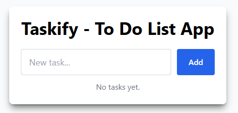
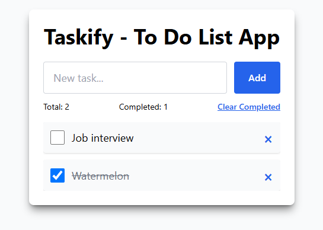

# 📝 Taskify - To-Do List App

**Taskify** is a sleek and responsive To-Do List application built with **React** and **TypeScript**. Easily add, complete, and manage your daily tasks with a clean and intuitive interface. Data is saved locally using LocalStorage for persistence.

---

## 🖼️ Preview

<p align="center">
  
  
</p>

---

## ⚙️ Getting Started

```bash
# Clone the repository
git clone https://github.com/soulucasdev/taskify.git

# Navigate into the project folder
cd taskify

# Install dependencies
npm install

# Start the development server
npm run dev
